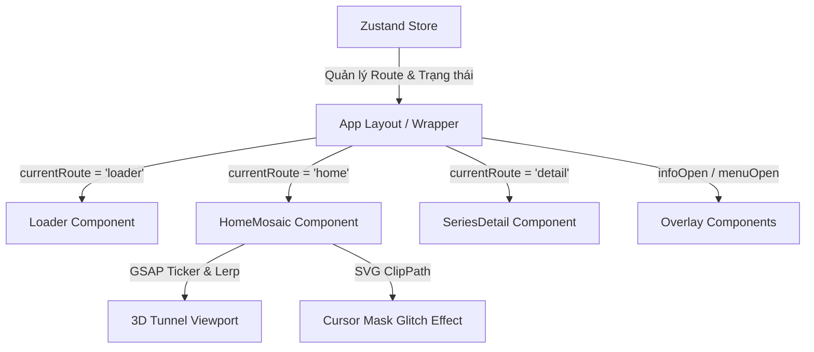

# Sơ đồ Luồng Dữ liệu & Hiệu ứng Guillaume Tomasi Replica

Tài liệu này mô tả chi tiết kiến trúc hệ thống, luồng dữ liệu của từng trang và cơ chế hoạt động của các hiệu ứng đặc trưng (nhất là hiệu ứng đường hầm 3D tại trang chủ).

Sơ đồ trực quan dạng ảnh đã được lưu tại thư mục:
- **Workspace:** [download/portfolio_flowchart.jpg](file:///C:/Users/needf/Documents/Portfolio%20Sinh%20(gallery)/download/portfolio_flowchart.jpg)
- **Hệ thống (Downloads):** `C:\Users\needf\Downloads\portfolio_flowchart.jpg`

---

## 1. Kiến Trúc Tổng Quan (System Architecture)

Dự án được xây dựng dựa trên template **Satus**, tuân thủ nghiêm ngặt các tiêu chuẩn của **Darkroom Engineering** với các công nghệ lõi:

- **Framework:** Next.js 16 (App Router) với React 19.2 (React Compiler).
- **Trạng thái (State):** Zustand (`lib/store/portfolioStore.ts`) quản lý route hiện tại, series active và trạng thái đóng/mở của các Overlay.
- **Hiệu ứng & Cuộn:** GSAP + Tempus (Single RAF loop) phối hợp với Lenis cho cuộn mượt ở trang chi tiết.
- **Layout & CSS:** Tailwind v4 kết hợp CSS Modules (`*.module.css`) cho các animation phức tạp.

---

## 2. Luồng Dữ liệu & Điều hướng Trang (Page Data Flow)

### A. Loader (Trang tải đầu tiên)
- **Mục đích:** Tạo ấn tượng thị giác mạnh mẽ khi truy cập.
- **Luồng hoạt động:**
  1. Khi app khởi chạy, `currentRoute` mặc định là `'loader'`.
  2. Hiệu ứng chữ chạy hoặc đếm số phần trăm được kích hoạt thông qua GSAP.
  3. Sau khi hoàn thành animation, store cập nhật `currentRoute` sang `'home'`.

### B. Trang Chủ (HomeMosaic)
- **Mục đích:** Tái hiện lại trải nghiệm bộ sưu tập ảnh dưới dạng đường hầm 3D (3D Image Tunnel) độc đáo.
- **Luồng dữ liệu:**
  1. Lấy dữ liệu ảnh từ `lib/data/portfolioData.ts`.
  2. Tính toán tọa độ không gian `(x, y, z)` cho từng bức ảnh dựa trên chương (series) của chúng. Mỗi chương sẽ nằm trên một mặt phẳng Z riêng biệt (Z-spacing = 5000px).
  3. Khi cuộn chuột (Mouse Wheel / Touchpad):
     - Thay đổi giá trị camera Z thực tế thông qua việc lắng nghe sự kiện cuộn.
     - Sử dụng thuật toán **Infinite Wrap** để khi đi qua hết một chương, chương đó sẽ tự động "nhảy" về phía sau/trước để tạo cảm giác cuộn vô tận.
  4. Khi click vào một bức ảnh:
     - Lưu lại `activeSeriesId`.
     - Kích hoạt chuyển cảnh (Z-zoom sát vào ảnh) và chuyển `currentRoute` sang `'detail'`.

### C. Trang Chi tiết (SeriesDetail)
- **Mục đích:** Trưng bày chi tiết các bức ảnh trong một bộ sưu tập cụ thể.
- **Luồng dữ liệu:**
  1. Lọc các ảnh thuộc `activeSeriesId` từ `portfolioData`.
  2. Kích hoạt cuộn mượt bằng **Lenis** để người dùng cuộn qua các bức ảnh.
  3. Khi click nút "Close" hoặc quay lại:
     - Cập nhật route về `'home'` và khôi phục lại vị trí camera Z tương ứng.

---

## 3. Chi tiết Hiệu ứng Đặc trưng (Key Animations)

### A. Hiệu ứng Đường hầm 3D Trang Chủ (3D Image Tunnel)
- **Cơ chế:** Sử dụng CSS 3D Transforms (`perspective` trên phần tử cha và `translate3d(x, y, z)` trên từng phần tử ảnh).
- **Parallax theo trỏ chuột:** Lắng nghe tọa độ chuột, sau đó thực hiện Lerp (Linear Interpolation) để dịch chuyển camera ngược hướng chuột nhẹ nhàng (camX, camY).
- **Fade sâu (Depth Fade-out):** Dựa vào khoảng cách Z của ảnh đến camera, áp dụng công thức opacity:
  $$opacity = \text{clamp}(1 - |z_{\text{relative}}| / 3500, 0, 1)$$

### B. Kính lúp / Con trỏ mặt nạ (Cursor Glitch Mask)
- **Cơ chế:** Sử dụng SVG `<clipPath>` hoặc CSS `mask-image`. 
- **Cách hoạt động:**
  - Có 2 lớp camera chồng khít lên nhau: Lớp cơ sở (Base) hiển thị ảnh mờ/đen trắng và lớp Mặt nạ (Masked) hiển thị ảnh gốc sắc nét/màu sắc.
  - Một phần tử SVG `<clipPath>` có dạng hình chữ nhật hoặc tròn di chuyển theo chuột bằng kỹ thuật Lerp.
  - Lớp camera thứ hai chỉ hiển thị bên trong phạm vi của `<clipPath>` này, tạo ra hiệu ứng rọi kính lúp vô cùng nghệ thuật.
  - Kết hợp góc xoay (tilt) của mặt nạ dựa trên tốc độ di chuyển của chuột để tạo độ sống động.

---

*Tài liệu này được biên soạn cho việc tái cấu trúc dự án chuẩn chỉ.*
